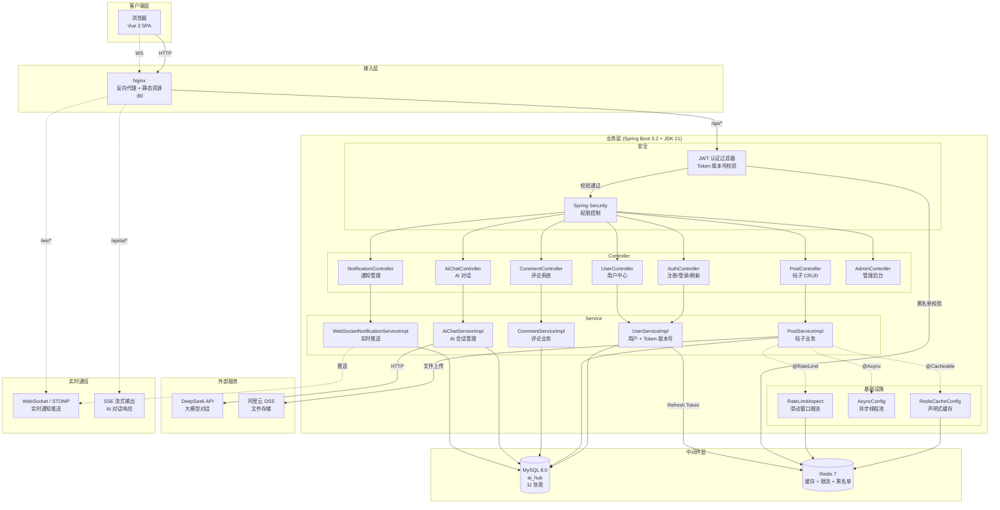
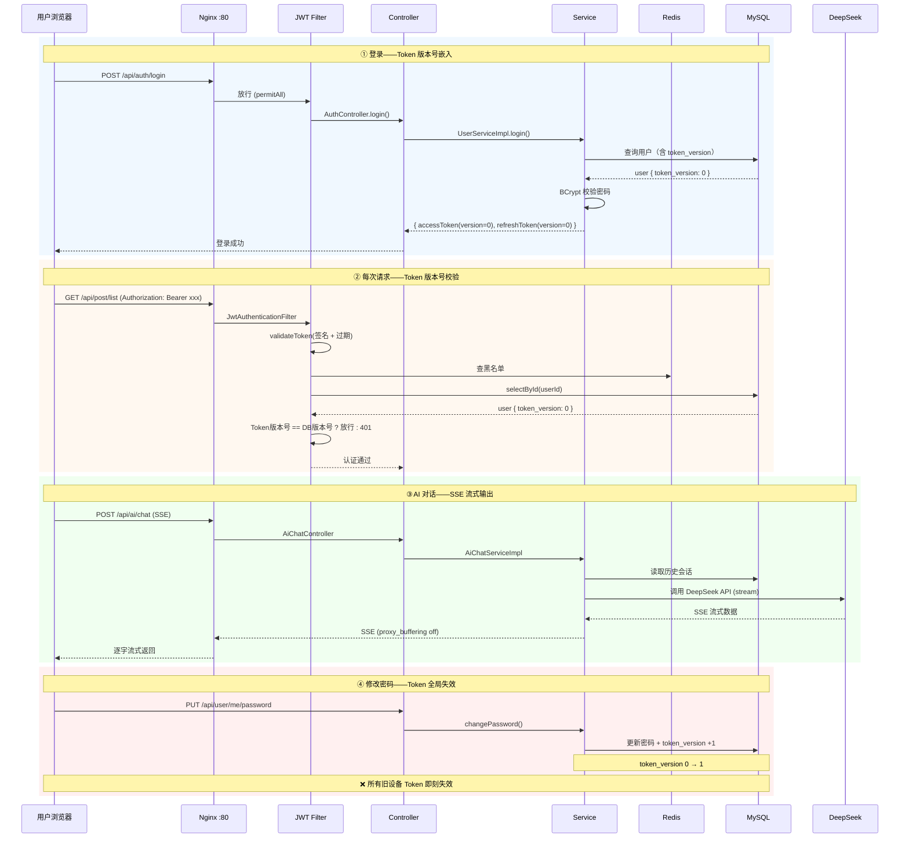
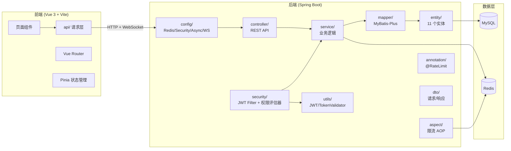
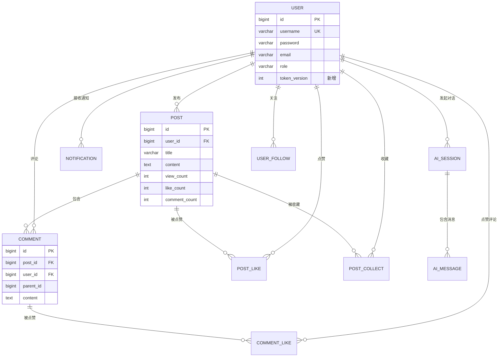

# AI Hub 系统架构图

## 整体架构

```mermaid
graph TB
    subgraph 客户端层
        BROWSER[浏览器<br/>Vue 3 SPA]
    end

    subgraph 接入层
        NGINX[Nginx<br/>反向代理 + 静态资源<br/>:80]
    end

    subgraph 业务层["业务层 (Spring Boot 3.2 + JDK 21)"]
        subgraph 安全
            FILTER[JWT 认证过滤器<br/>Token 版本号校验]
            SECURITY[Spring Security<br/>权限控制]
        end

        subgraph Controller
            AUTH[AuthController<br/>注册/登录/刷新]
            POST[PostController<br/>帖子 CRUD]
            COMMENT[CommentController<br/>评论系统]
            USER[UserController<br/>用户中心]
            NOTIFY[NotificationController<br/>通知管理]
            AI[AiChatController<br/>AI 对话]
            ADMIN[AdminController<br/>管理后台]
        end

        subgraph Service
            POST_SVC[PostServiceImpl<br/>帖子业务]
            COMMENT_SVC[CommentServiceImpl<br/>评论业务]
            USER_SVC[UserServiceImpl<br/>用户 + Token 版本号]
            AI_SVC[AiChatServiceImpl<br/>AI 会话管理]
            NOTIFY_SVC[WebSocketNotificationServiceImpl<br/>实时推送]
        end

        subgraph 基础设施
            AOP_LIMIT[RateLimitAspect<br/>滑动窗口限流]
            ASYNC[AsyncConfig<br/>异步线程池]
            CACHE[RedisCacheConfig<br/>声明式缓存]
        end
    end

    subgraph 中间件层
        MYSQL[(MySQL 8.0<br/>ai_hub<br/>11 张表)]
        REDIS[(Redis 7<br/>缓存 + 限流 + 黑名单)]
    end

    subgraph 外部服务
        DEEPSEEK[DeepSeek API<br/>大模型对话]
        OSS[阿里云 OSS<br/>文件存储]
    end

    subgraph 实时通信
        WEBSOCKET[WebSocket / STOMP<br/>实时通知推送]
        SSE[SSE 流式输出<br/>AI 对话响应]
    end

    %% 请求流
    BROWSER -->|HTTP| NGINX
    BROWSER -.->|WS| NGINX

    NGINX -->|/api/*| FILTER
    NGINX -.->|/ws/*| WEBSOCKET
    NGINX -.->|/api/ai/*| SSE

    FILTER -->|校验通过| SECURITY
    SECURITY --> AUTH
    SECURITY --> POST
    SECURITY --> COMMENT
    SECURITY --> USER
    SECURITY --> NOTIFY
    SECURITY --> AI
    SECURITY --> ADMIN

    AUTH --> USER_SVC
    POST --> POST_SVC
    COMMENT --> COMMENT_SVC
    USER --> USER_SVC
    AI --> AI_SVC
    NOTIFY --> NOTIFY_SVC

    POST_SVC -.->|"@Cacheable"| CACHE
    POST_SVC -.->|"@RateLimit"| AOP_LIMIT
    POST_SVC -.->|"@Async"| ASYNC

    USER_SVC --> MYSQL
    POST_SVC --> MYSQL
    COMMENT_SVC --> MYSQL
    AI_SVC --> MYSQL
    NOTIFY_SVC --> MYSQL

    CACHE --> REDIS
    AOP_LIMIT --> REDIS
    FILTER -->|黑名单校验| REDIS
    USER_SVC -->|Refresh Token| REDIS

    AI_SVC -->|HTTP| DEEPSEEK
    POST_SVC -->|文件上传| OSS
    NOTIFY_SVC -.->|推送| WEBSOCKET
```

## 核心链路

```mermaid
sequenceDiagram
    participant U as 用户浏览器
    participant N as Nginx :80
    participant F as JWT Filter
    participant C as Controller
    participant S as Service
    participant R as Redis
    participant M as MySQL
    participant AI as DeepSeek

    %% 登录链路
    rect rgb(240, 248, 255)
        Note over U,M: ① 登录——Token 版本号嵌入
        U->>N: POST /api/auth/login
        N->>F: 放行 (permitAll)
        F->>C: AuthController.login()
        C->>S: UserServiceImpl.login()
        S->>M: 查询用户（含 token_version）
        M-->>S: user { token_version: 0 }
        S->>S: BCrypt 校验密码
        S-->>C: { accessToken(version=0), refreshToken(version=0) }
        C-->>U: 登录成功
    end

    %% 请求校验链路
    rect rgb(255, 248, 240)
        Note over U,M: ② 每次请求——Token 版本号校验
        U->>N: GET /api/post/list (Authorization: Bearer xxx)
        N->>F: JwtAuthenticationFilter
        F->>F: validateToken(签名 + 过期)
        F->>R: 查黑名单
        F->>M: selectById(userId)
        M-->>F: user { token_version: 0 }
        F->>F: Token版本号 == DB版本号 ? 放行 : 401
        F-->>C: 认证通过
    end

    %% AI 对话链路
    rect rgb(240, 255, 240)
        Note over U,AI: ③ AI 对话——SSE 流式输出
        U->>N: POST /api/ai/chat (SSE)
        N->>C: AiChatController
        C->>S: AiChatServiceImpl
        S->>M: 读取历史会话
        S->>AI: 调用 DeepSeek API (stream)
        AI-->>S: SSE 流式数据
        S-->>N: SSE (proxy_buffering off)
        N-->>U: 逐字流式返回
    end

    %% 修改密码链路
    rect rgb(255, 240, 240)
        Note over U,M: ④ 修改密码——Token 全局失效
        U->>C: PUT /api/user/me/password
        C->>S: changePassword()
        S->>M: 更新密码 + token_version +1
        Note over S,M: token_version 0 → 1
        Note over U,M: ❌ 所有旧设备 Token 即刻失效
    end
```

## 项目模块划分

```mermaid
graph LR
    subgraph 前端["前端 (Vue 3 + Vite)"]
        VIEWS[页面组件]
        API[api/ 请求层]
        ROUTER[Vue Router]
        STORE[Pinia 状态管理]
    end

    subgraph 后端["后端 (Spring Boot)"]
        direction TB
        CONFIG[config/<br/>Redis/Security/Async/WS]
        CTL[controller/<br/>REST API]
        SVC[service/<br/>业务逻辑]
        MAPPER[mapper/<br/>MyBatis-Plus]
        ENTITY[entity/<br/>11 个实体]
        SEC[security/<br/>JWT Filter + 权限评估器]
        ASPECT[aspect/<br/>限流 AOP]
        ANNO["annotation/<br/>@RateLimit"]
        DTO[dto/<br/>请求/响应]
        UTILS[utils/<br/>JWT/TokenValidator]
    end

    subgraph 数据["数据层"]
        DB[(MySQL)]
        CACHE[(Redis)]
    end

    VIEWS --> API
    API -->|HTTP + WebSocket| CONFIG
    CONFIG --> CTL
    CTL --> SVC
    SVC --> MAPPER
    MAPPER --> ENTITY
    ENTITY --> DB
    SVC --> CACHE
    ASPECT --> CACHE
    SEC --> SVC
    SEC --> UTILS
```

## 数据表关系

```mermaid
erDiagram
    USER ||--o{ POST : 发布
    USER ||--o{ COMMENT : 评论
    USER ||--o{ NOTIFICATION : 接收通知
    USER ||--o{ AI_SESSION : 发起对话
    USER ||--o{ POST_LIKE : 点赞
    USER ||--o{ POST_COLLECT : 收藏
    USER ||--o{ COMMENT_LIKE : 点赞评论
    USER ||--o{ USER_FOLLOW : 关注

    POST ||--o{ COMMENT : 包含
    POST ||--o{ POST_LIKE : 被点赞
    POST ||--o{ POST_COLLECT : 被收藏

    COMMENT ||--o{ COMMENT_LIKE : 被点赞

    AI_SESSION ||--o{ AI_MESSAGE : 包含消息

    USER {
        bigint id PK
        varchar username UK
        varchar password
        varchar email
        varchar role
        int token_version "新增"
    }

    POST {
        bigint id PK
        bigint user_id FK
        varchar title
        text content
        int view_count
        int like_count
        int comment_count
    }

    COMMENT {
        bigint id PK
        bigint post_id FK
        bigint user_id FK
        bigint parent_id
        text content
    }
```
