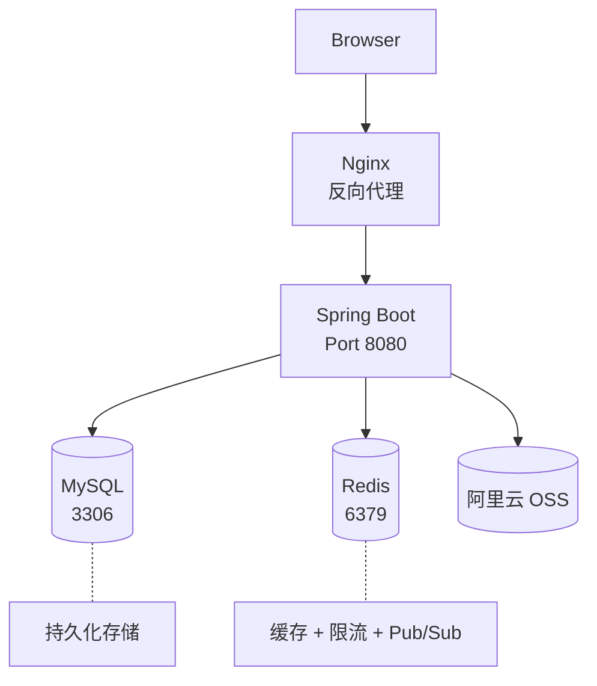
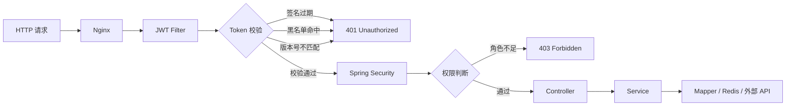
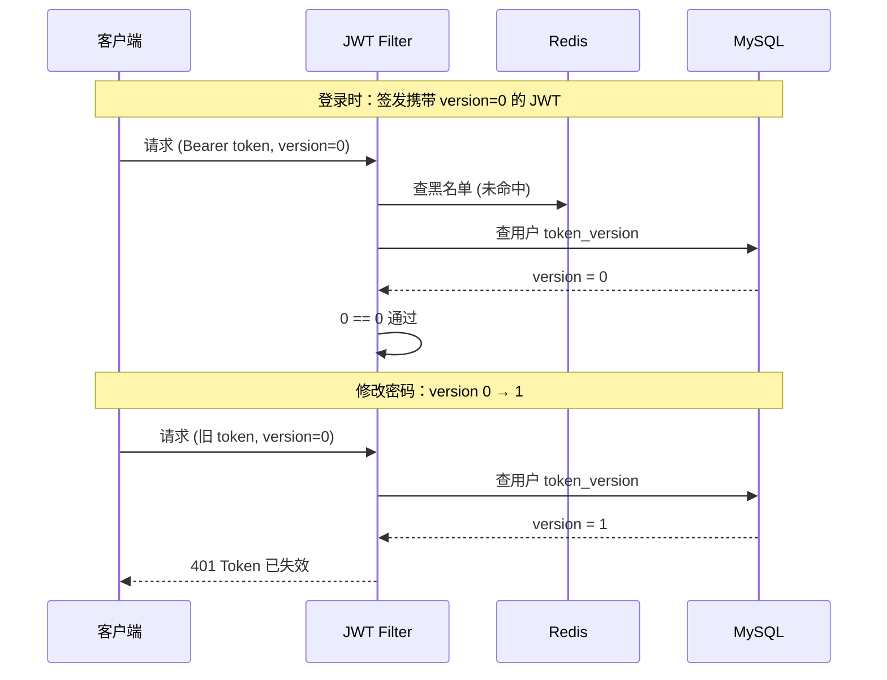
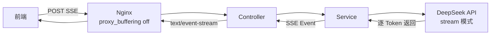

# AI Hub 社区平台 — 系统架构

> 基于 Spring Boot 3.2 + JDK 21 的 AI 社区平台，涵盖用户认证、内容社区、AI 多轮对话、实时通知等核心功能。

---

## 一、整体架构

---

## 二、请求生命周期

**要点说明：**
- JWT Filter 作为第一道关卡，校验 Token 签名、过期时间、Redis 黑名单、Token 版本号四重验证
- Spring Security 基于角色的权限控制（ROLE_USER / ROLE_ADMIN）
- Token 版本号机制：修改密码时 `token_version + 1`，所有已签发的旧 Token 立即失效

---

## 三、核心设计亮点

### 3.1 Token 版本号 — 全局踢人机制

**面试要点：** JWT 本身无状态无法主动失效，通过引入数据库版本号 + Filter 层校验，实现了有状态的 JWT 管理，兼顾了性能和安全性。

### 3.2 Redis 多维度应用

| 用途 | 实现方式 | 面试关键词 |
|------|---------|-----------|
| 接口缓存 | `@Cacheable` 声明式缓存 | 缓存穿透/击穿/雪崩 |
| 接口限流 | ZSET 滑动窗口 + `@RateLimit` AOP | 令牌桶 vs 滑动窗口 |
| Token 黑名单 | 登出时将 Token 存入 Redis | 主动失效机制 |
| Refresh Token | 存储于 Redis，支持无感刷新 | 双 Token 方案 |

### 3.3 AI 对话 — SSE 流式输出

**面试要点：** 使用 Server-Sent Events 替代 WebSocket 实现 AI 流式响应，Nginx 关闭 proxy_buffering 保证逐字输出，降低首字延迟。

### 3.4 异步与并发优化

- **浏览量计数**：`@Async` 异步更新，不阻塞主请求
- **通知推送**：WebSocket + STOMP 协议，实时推送评论/点赞通知
- **缓存预热**：热门帖子列表走 Redis 缓存，减轻 DB 压力

---

## 四、技术栈总览

| 层级 | 技术选型 |
|------|---------|
| 框架 | Spring Boot 3.2.5 + JDK 21 |
| ORM | MyBatis-Plus 3.5.7 |
| 安全 | Spring Security + JWT (HS512) |
| 缓存 | Redis + Spring Cache (`@Cacheable`) |
| 限流 | Redis ZSET 滑动窗口 + 自定义注解 + AOP |
| 实时通信 | WebSocket + STOMP |
| AI | Spring AI + DeepSeek API (SSE) |
| 文件 | 阿里云 OSS |
| 部署 | Docker Compose + Nginx |

---

## 五、面试常见追问准备

**Q: 为什么用 Token 版本号而不是 Redis 存所有有效 Token？**
> 有效 Token 数量远大于失效 Token，黑名单方案空间效率更高。版本号方案只需一次整数比较就能实现全局失效。

**Q: 滑动窗口限流怎么实现的？**
> 自定义 `@RateLimit` 注解 + AOP 切面，使用 Redis ZSET 存储请求时间戳，`ZRANGEBYSCORE` 统计窗口内请求数，时间复杂度 O(log N)。

**Q: 缓存和数据库一致性怎么保证？**
> 写操作时通过 `@CacheEvict` 清除缓存，读操作时 `@Cacheable` 自动回填。对于强一致性场景，采用先更新 DB 再删缓存的策略。

**Q: SSE 和 WebSocket 的区别？为什么 AI 对话用 SSE？**
> SSE 是单向通信（服务端→客户端），WebSocket 是双向。AI 对话场景是"请求-流式响应"，不需要客户端持续发送，SSE 更轻量且天然支持 HTTP 基础设施。
